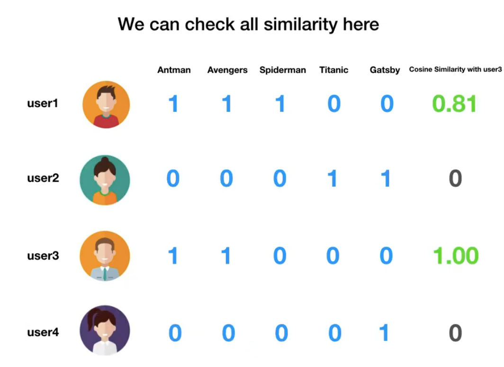

# 추천 시스템 기본

# 1. 기본

https://www.youtube.com/watch?v=_YndKkun2Sw

- Collaborative filtering ⇒ 사전학습때 학습했던 것 (KNN)
    - cosine similarity 등을 이용해 유저간의 유사도를 측정한다
        
        
        
        → 유저 1과 3이 상당히 비슷하기 때문에 유저3에게 스파이더맨 추천(유저 1은 보고 유저3은 보지 않은 영화)
        
- Item based filtering
    
    
    
    → 개츠비와 타이타닉이 비슷한 영화라면 개츠비를 본 유저4에게 타이타닉을 추천해줄 수 있다. 
    
    
    
- 만약 새로운 영화가 출시되었다면 해당 영화를 어떻게 추천해줄 수 있을까?
    - 아무도 해당 영화에 좋아요 버튼을 누르지 않았기 때문에 위의 두 가지 방법으로는 추천할 수 없다 : Cold start problem
    - Content-based Filtering으로 해당 문제를 해결할 수 있다.
- Content-based Filtering
    
    
    
    - 각 아이템 고유의 특성을 바탕으로 cosine similarity를 구해서 가장 유사한 아이템을 추천해준다.

# 2. 현업 사례 1 - 멜론

## 2.1. content-based filtering

- 대상 자체의 특성을 바탕으로 추천하는 방법론
- 음악의 경우 딥러닝을 사용해서 음악의 특성을 추출함.
    - Convolutional model 사용

## 2.2. collaborative filtering

- 다른 사람들이 들은 곡들을 바탕으로 어떤 곡들이 서로 비슷한지를 알아내는 방법
- Matrix Factorization 모델 사용
    - 유저 x 곡 매트릭스를 랭크가 작은 두 개의 매트릭스로 나눔
    - 나눈 두 개의 매트릭스의 곱이 원래의 매트릭스와 비슷하게 나오도록 학습하는 방법
    - 위와 같이 압축-복원 과정에서 원래 유저가 소비하지 않았던 곡들에 대한 숫자들이 나오게 되는데, 이 숫자들이 유저에 대한 해당 곡의 계산된 선호도임
- AutoEncoder을 사용하기도 함
    - 입력 데이터 → 작은 데이터로 압축 → 원래의 데이터로 복원
    - 위의 복원 과정에서 원본에서 가장 중요한 핵심 값들이 나오는 방식
    - 음악 추천 작업에 응용 : 사용자의 플레이리스트에 해당 곡이 들어있다면 1, 없다면 0 → 인코더 스텝에서 나온 임베딩을 기반으로 원래 플레이리스트에 들어있었을 곡 유추
    - Denoising autoencoder : 모든 곡이 아니라 내가 들은 곡의 일부만 학습 데이터로 이용
    - autoencoder을 사용하면 태그 등의 부차적인 정보도 같이 넣을 수 있다.
        - 입력으로 곡 목록 넣기 → 이 곡 목록에서 latent feature를 뽑음 → 디코딩 시 목록과 태그 같이 학습 ⇒ 태그들이 곡을 설명하는 역할을 하도록 할 수 있다.

# 3. 현업 사례 2 - 웹툰

https://www.slideshare.net/slideshow/ss-164511610/164511610

## 3.1. 개인화 추천 - 홈추천

- 유저에게 CTR(%)이 가장 높을 작품 추천
    - CTR : 클릭률
- 사용되는 추천 모델들
    - MAB (Multi Armed Bandit)
    - User Clustering
- MAB (Multi Armed Bandit)
    - 일부 트래픽으로 작품을 랜덤하게 노출하여 Feedback 수집(impression, click)
    - Feedback으로부터 작품의 CTR을 측정한다.
        - CTR(%) = # of clicks / # of impressions
    - CTR이 높은 상위 작품만 90%의 트래픽에 노출하여 전체 CTR을 높임
    - 대부분의 추천 시스템에서 TS-MAB가 가장 좋은 성능을 발휘함
        - Thompson Sampling MAB
        - TS-MAB은 탐색&활용 Trade-off에서 적절히 Regret을 최소화시킴
- User Clustering
    - 작품의 CTR은 유저 성향별로 다르기 때문에 유사한 유저끼리 군집화를 하여 각 클러스터의 작품 열람전환율 측정
    - Clustering 방법 : 유저가 최근 읽은 작품들 → 읽은 작품의 CB(image, Text) Feature로 User Feature 생성 → 유사한 유저끼리 클러스터링
- 개인화 홈 추천 Flow
    - 유저 → 클러스터 할당 → User Clustering으로 추천할 만한 작품 Targeting → MAB를 통해 후보 작품을 Ranking

## 3.2. 연관추천 - ViewerEnd 추천

- 현재 읽고 있는 작품과 유사한 작품 중 열람수를 늘리기 위해 CTR(%)가 가장 높을 작품 추천
- 사용되는 추천 모델들
    - Item Feature (작품의 특징 추출)
    - MAB (Multi Armed Bandit)
- 연관 추천 Flow
    - 작품 → 작품 Feature를 통해 유사한 작품 Targeting → MAB를 통해 후보 작품을 Ranking
    - 유저가 선택한 작품은 유저가 관심이 있다는 강한 피드백이므로, 해당 작품과 비슷한 작품을 추천
- Item Feature
    - Image Feature : 썸네일로부터 스타일/객체를 인식하여 Image특징을 추출
        - Image Style 유사 : Style transfer network
        - Image 객체 유사 : Pre-trained VGG19 Model
    - Text Feature : 작품 제목, 설명으로 Text 특징을 추천
        - Word2Vec (keyword가 유사한 작품을 찾음)
    - CF-Feature : 유저 Feedback으로부터 작품간의 상관 특징을 추출
        - Matrix Factorization(ALS) with Implicit Feedback
        - 유저들이 소비한 정보의 Item-User 상관관계로부터 작품의 특징을 추출하여 유사한 작품 추천
- 유사 작품 추천
    - 특정 작품을 읽은 다음에 MAB로 유사 작품들의 열람 전환율(%)을 측정 → 열람 전환율이 높은 작품을 추천

# 4. 현업 사례 3 - 삼성SDS 딥러닝을 통한 추천 시스템 고도화

https://www.youtube.com/watch?v=h6vePourB7E

## 4.1. 컨텐츠 유사도 기반 추천

- 과거에 소비했던 컨텐츠와 유사한 컨텐츠 추천
- 딥러닝 사용
    - 대용량 컨텐츠의 특징을 추출할 때 유리
    - 비선형적이므로 사용자와 컨텐츠 간의 복잡한 관계를 포착할 수 있음
    - 충분히 많은 데이터를 학습했을 경우 새로운 데이터에 대한 유연한 처리 가능
- 현업 사례
    - 컨텐츠들의 특성이 반영된 컨텐츠 벡터 공간에서 유사한 컨텐츠 추천
    - 컨텐츠의 이미지, 제목, 태그 등 여러 메타 정보들을 사용할 수 있음 → 컨텐츠 스크립트 사용
    - 전처리 : 컨텐츠 스크립트를 딥러닝 학습에 적합한 단어-빈도 벡터 형태로 변환
        - 전체 스크립트에서 유효한 단어 2000개 선정
    - 딥러닝에 의한 컨텐츠 벡터 공간 학습
        - 컨텐츠들의 특성이 반영된 컨텐츠 벡터 공간 생성 → 컨텐츠 벡터 공간에서 근사는 컨텐츠의 유사함을 의미
        - cosine similarity 사용

## 4.2. 선호도 기반 추천

- 취향이 유사한 사용자들이 좋아하는 컨텐츠들을 추천 (협업 필터링)
- 기존 : Matrix Factorization을 이용하여 사용자의 컨텐츠 선호도 예측
- 시도 : 딥러닝을 활용한 협업 필터링 - Auto-encoder 기반
    - auto-encoder의 차원 축소-복구 과정을 이용한 컨텐츠 추천
    - 비선형 활성 함수(activation function)를 활용해 사용자간의 관계를 모델링해 기존 선형 학습법에 비해 성능 향상
    - 단순 Matrix Factorization에 비해 sparse matrix에서 좋은 성능 보임
    - 평점 추천(입력이 평점 형태인 경우), 순위 추천(입력이 1 or 0인 경우)에 모두 활용 가능
- 현업 사례 : VAE를 이용한 Matrix completion
    - 학습된 Variational Auto-encoder(VAE)에 사용자-컨텐츠 matrix를 입력했을 때 출력되는 matrix를 통해 컨텐츠 추천
    - 사용자가 컨텐츠를 시청한 이력 기반으로 binary matrix 제작 (시청 정보가 있으면 1, 없으면 0)

## 4.3. 앞으로 할 일

- 협업 필터링은 초기 사용자 문제가 있고, 유사 컨텐츠 추천은 사용자의 취향이 반영되었다고 보기 어렵기 때문에 하이브리드 모델을 개발할 예정이다.